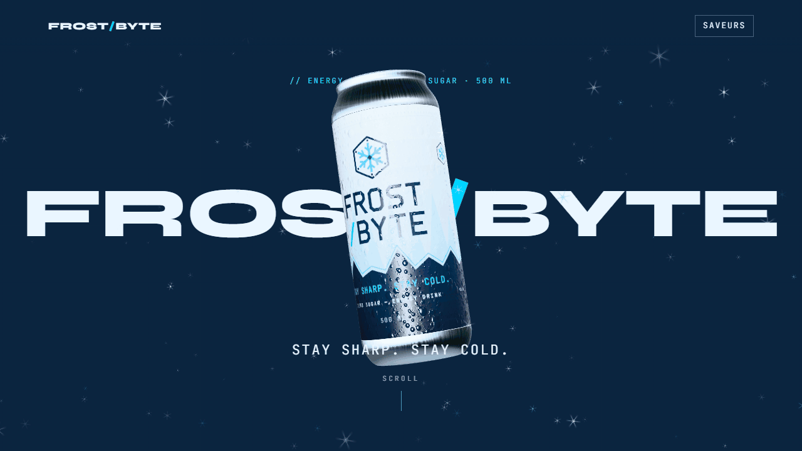

# FROST/BYTE

[](https://sean-hardel.github.io/frostbyte/)

[](https://github.com/sean-hardel/frostbyte/actions/workflows/ci.yml)

**Site en ligne : [sean-hardel.github.io/frostbyte](https://sean-hardel.github.io/frostbyte/)**

Marque fictive de boisson énergisante (projet démo), présentée en trois livrables :

- **Modèle 3D** de la canette, construit dans Blender via le MCP Blender (`blender/`)
- **Landing page** animée au scroll : Vite, Three.js, GSAP ScrollTrigger (`site/`)
- **Trailer** vidéo en 16:9 (25 s) et 9:16 (15 s) : Remotion, plans rendus avec Blender Cycles (`trailer/`)

## Démarrage

```sh
# Site
cd site && npm install && npm run dev

# Trailer (nécessite les rendus Blender et la musique, voir ci-dessous)
cd trailer && npm install
npm run render:shots   # rendus Blender Cycles GPU (~1 h)
npm run render         # out/trailer.mp4 et out/trailer-vertical.mp4
```

La musique du trailer n'est pas versionnée : la télécharger depuis
[Pixabay](https://pixabay.com/music/upbeat-60000-light-years-140306/) et la placer dans `trailer/public/musique.mp3`.

Conventions, pipeline d'assets et détails techniques : [CLAUDE.md](CLAUDE.md).

## CI et déploiement

Le workflow [`ci.yml`](.github/workflows/ci.yml) tourne sur chaque push et chaque pull request : installation,
typecheck et build du site, puis Lighthouse CI en profil mobile et desktop (3 passes chacun). Le job échoue si
la performance, l'accessibilité ou les bonnes pratiques passent sous 90. Sur un push vers `main`, si tout passe,
le site est déployé sur GitHub Pages. Les rapports Lighthouse sont disponibles en artefact de chaque run.

## Développement

Ce projet a été développé avec [Claude Code](https://claude.com/claude-code) comme assistant de développement.
La conception, les choix techniques, la direction artistique et la validation à chaque étape sont de Sean Hardel.

## Crédits

- **Musique du trailer** : « 60,000 Light Years » par **Jim_Combs**, sur
  [Pixabay](https://pixabay.com/music/upbeat-60000-light-years-140306/), sous
  [Pixabay Content License](https://pixabay.com/service/license-summary/).
- **Effets sonores** : Freesound, CC0 (gleepglop, karlis.stigis, qubodup, Jofae) — détail dans
  [trailer/public/sfx/CREDITS.md](trailer/public/sfx/CREDITS.md).
- **HDRI** : « Studio Small 03 » par Greg Zaal, [Poly Haven](https://polyhaven.com/a/studio_small_03), CC0.
- **Polices** : Syne et JetBrains Mono, SIL Open Font License 1.1 (`brand/fonts/`).

## Licence

Le dépôt mélange du code, des créations visuelles et des contenus tiers ; chacun a sa licence.

| Contenu | Licence |
|---|---|
| **Code** : `site/src`, `trailer/src`, scripts (`blender/scripts`, `blender/tools`, `site/scripts`, `trailer/scripts`), configuration, CI | [MIT](LICENSE) — © 2026 Sean Hardel |
| **Créations visuelles et marque** : nom, logo et identité FROST/BYTE, textures (`blender/textures/`), modèle et rendus Blender (`canette.blend`, `canette.glb`, `hero-can.webp`), posters du trailer, `docs/demo.gif` | [CC BY-NC 4.0](LICENSE-ASSETS) — © 2026 Sean Hardel |
| **Musique** du trailer (non versionnée) | [Pixabay Content License](https://pixabay.com/service/license-summary/) |
| **Vidéos du trailer** (`site/public/trailer/*.mp4`, `*.webm`) | Exclues de la CC, car elles contiennent la musique Pixabay : tous droits réservés pour l'image, musique sous licence Pixabay |
| **Effets sonores** (`trailer/public/sfx/`) | CC0 (Freesound) |
| **HDRI** « Studio Small 03 » (dans `canette.blend` et `site/public/env/`) | CC0 (Poly Haven) |
| **Polices** Syne et JetBrains Mono (`brand/fonts/`) | [SIL OFL 1.1](brand/fonts/OFL-Syne.txt) ([JetBrains Mono](brand/fonts/OFL-JetBrainsMono.txt)) |

La licence MIT couvre le code, mais pas le logo qu'il reproduit (`Wordmark.tsx`, `Crystal.tsx`, favicon,
écran de chargement), qui reste sous CC BY-NC 4.0. FROST/BYTE est une marque fictive : la CC ne donne aucun
droit sur le nom ou le logo pour désigner un autre produit. Détail complet et liste des fichiers :
[LICENSE-ASSETS](LICENSE-ASSETS).
